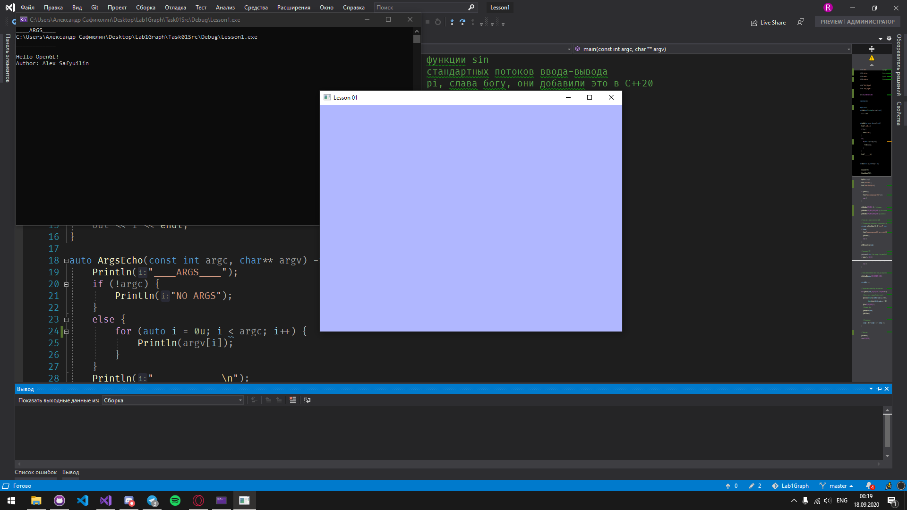

# Лабораторная работа №1
## Отчёт по лабораторной работе<br>по дисциплине "Вычислительная геометрия и компьютернач графика"<br>студента группы ПА-18-2<br>Сафиюлина Александра Александровича

### Постановка задачи

Тема: "Знакомство с OpenGL"

#### Задания:
1. Ознакомится с возможностями графической библиотеки OpenGL. Разобраться с особенностями подключения библиотеки GLFW;
2. С помощью шаблона программы (RAINBOW) рассмотреть и запустить код;
3. С помощью функции glfwWindowHint(...) подключить OpenGL 3.3 или другой версии, которую поддерживает ваш CPU;
4. Добавить в консоль вывод:
   ```
   Hello OpenGL!  
   Author: Alex Safyuilin  
   ```
5. Создать окно glfwCreateWindow(...) с названием "Lesson 01 - RAINBOW - Alex Safyuilin ПА-18-2"

### Описание решения:

#### Код:

```cpp
#include <cmath>                                        // для функции sin
#include <iostream>                                     // для стандартных потоков ввода-вывода
#include <numbers>		                        // для pi, слава богу, они добавили это в C++20
#include <windows.h>                                    // для локализации конслои

#include "libs\GL_AL\glew.h"
#include "libs\GL_AL\glfw3.h"

#define GLUT_DISABLE_ATEXIT_HACK

using namespace std;

template <class T>
auto Println(const T i, ostream& out = cout) -> void {
    out << i << endl;
}

auto ArgsEcho(const int argc, char** argv) -> void {
    Println("____ARGS____");
    if (!argc) {
        Println("NO ARGS");
    }
    else {
        for (auto i = 0; i < argc; i++) {
            Println(argv[i]);
        }
    }
    Println("____________\n");
}

auto main(const int argc, char** argv) -> int {

    SetConsoleCP(1251);
    SetConsoleOutputCP(1251);
    
    ArgsEcho(argc, argv);
    Println("Hello OpenGL!");
    Println("Author: Alex Safyuilin");

    if (!glfwInit()) {
        Println("Ошибка при инициализации GLFW\n", cerr);
        return -1;
    }
    
    glfwWindowHint(GLFW_SAMPLES, 8); // 8x Сглаживание
    glfwWindowHint(GLFW_CONTEXT_VERSION_MAJOR, 4); // Мы хотим использовать максимальную
    glfwWindowHint(GLFW_CONTEXT_VERSION_MINOR, 6); // OpenGL 4.6
    
    // Открыть окно и создать в нем контекст OpenGL
    // (В сопроводительном исходном коде эта переменная является глобальной)
    auto* window = glfwCreateWindow( 640, 480, "Lesson 01", nullptr, nullptr);
    if (!window) {
        Println("Невозможно открыть окно GLFW. Если у вас Intel GPU, то он не поддерживает версию 3.3. Попробуйте версию уроков для OpenGL 2.1.", std::cerr);
        glfwTerminate();
        return -1;
    }
    glfwMakeContextCurrent(window);

    // Инициализируем GLEW
    glewExperimental = true; // Флаг необходим в Core-режиме OpenGL
    if (glewInit() != GLEW_OK) {
        Println("Невозможно инициализировать GLEW", std::cerr);
        return -1;
    }

    // Включим режим отслеживания нажатия клавиш, для проверки ниже
    glfwSetInputMode(window, GLFW_STICKY_KEYS, GL_TRUE);

    auto colorRgb = 0.f;
	
    // Проверяем нажатие клавиши Escape или закрытие окна
    while (glfwGetKey(window, GLFW_KEY_ESCAPE) != GLFW_PRESS && !glfwWindowShouldClose(window)) {
        // Пока что ничего не выводим. Это будет в уроке 2.
        glClearColor(GLclampf(sin(colorRgb * numbers::pi / 180.f)), GLclampf(abs(cos(colorRgb * numbers::pi / 180.f))),
                    GLclampf(abs(sin(colorRgb * numbers::pi / 180.f))) + GLclampf(cos(colorRgb * numbers::pi / 180.f)), GLclampf(1.0f));
        glClear(GL_COLOR_BUFFER_BIT);
        // Сбрасываем буферы
        glfwSwapBuffers(window);
        glfwPollEvents();

        // Увеличиваем цвет 
        colorRgb <= 180.f ? colorRgb += 0.1f : colorRgb = 0.f;
    } 
    
    // Убиваем окно
    glfwTerminate();
    return EXIT_SUCCESS;
}
```

#### Описание интерфейса программы


